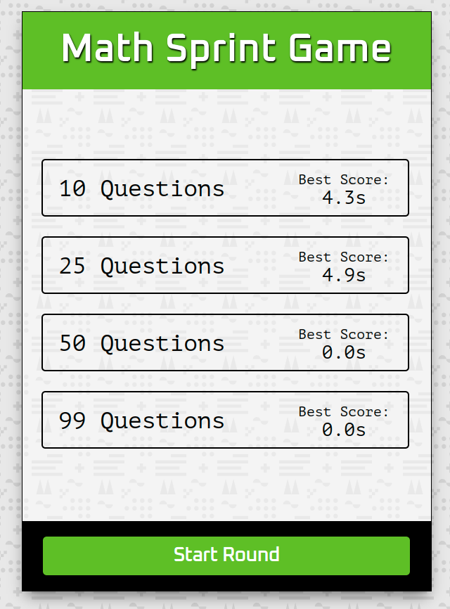

# basicJS_Math Sprint Game: [LIVE DEMO](https://shcoobz.github.io/basicJS_math-sprint-game/)

## Summary

Math Sprint Game provides a dynamic environment for users to practice their math skills under time pressure. It features a user-friendly interface, adjustable difficulty levels, and immediate feedback on performance.

The core functionality includes:

- Multiple choice settings for the number of questions (10, 25, 50, or 99).
- Real-time calculation feedback to test correctness and speed.
- Tracking and displaying best scores to gauge improvement over time.

## Features

### Dynamic Question Generator

Math Sprint Game dynamically generates math equations, offering a mix of correct and incorrect answers that challenge the player's speed and accuracy in arithmetic operations.

### Score Tracking and Best Scores

The game records players' scores based on their speed and accuracy, stores them locally, and displays the best scores for each difficulty level to motivate improvement.

### Timed Rounds

Each round is timed, adding a layer of challenge by encouraging faster problem solving. This feature is crucial for developing quicker mental calculation skills.

### Additional Features

- Responsive design to cater to different device sizes.
- Animated countdown to kick-start each game round, enhancing the game's interactive experience.

## Technologies

- HTML5: Structuring and presenting content for the web.
- CSS3: Styling and layout of the web page.
- JavaScript: Adding interactivity, storing scores in local storage, and managing game logic.

---

_Note: This document provides an overview of Math Sprint Game. For detailed instructions and more information, please refer to the source code documentation._

_This project has been enhanced and converted into a React-based application, which can be viewed [here](https://github.com/Shcoobz/react_math-sprint-game/). The React version integrates more advanced state management and component-based architecture for improved maintainability and scalability._
